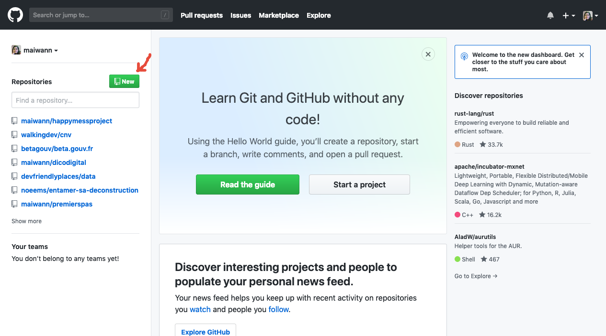

# Étape 1 : Créer son projet

Petit journal de mes itérations dans la découverte de GitHub Pages, un moyen de générer un site statique facilement…il paraît !

## Créer un compte GitHub

Première étape, créer son compte Github.

L'offre gratuite convient tout à fait, n'oubliez pas de valider votre adresse mail après coup (ça servira pour la suite).

## Premier répertoire

Une fois votre compte créé, rendez-vous sur la page d'accueil de Github : https://github.com/

On va créer un nouveau projet ou répertoire, appellé "repository" sur l'interface. On clique donc sur "New repository"

On arrive au paramétrage des options:

### Obligatoires
On donne un nom à son projet (dans l'image je l'ai appellé "premierspas")

Cocher la case "Initialize this repository with a README"

### Optionnels
Mettre une description à son projet

Lui choisir une licence (mais si vous voulez en mettre une, il y a un petit formulaire pour faire son choix par ici : https://creativecommons.org/choose/

Et on valide ! 

## Final

Félicitations, votre projet est créé ! Prochaine étape : Le paramétrage pour lui dire "Salut, je veux que tu utilise GitHubPages en fait !"
