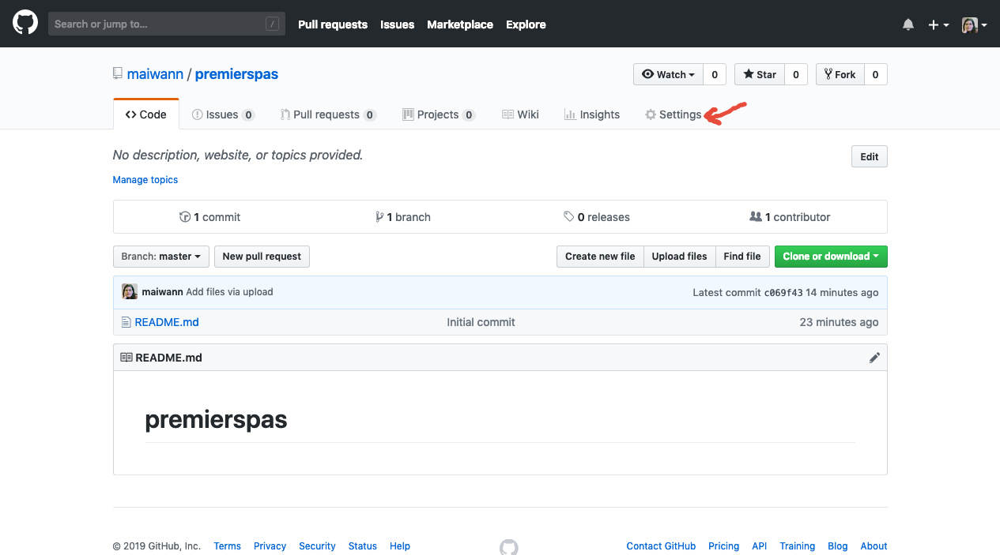
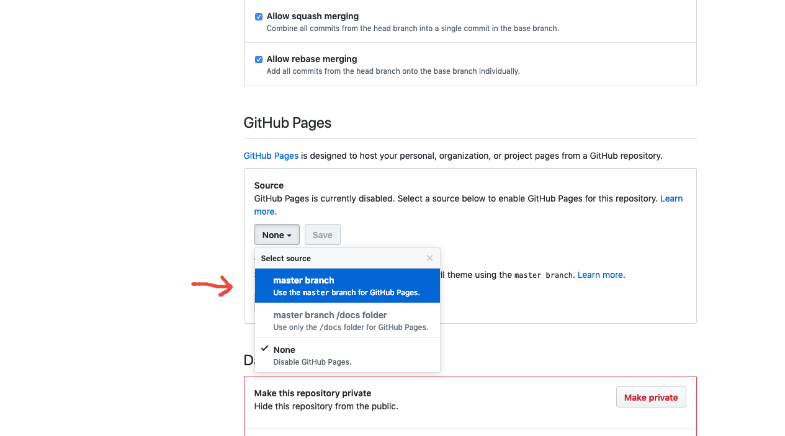
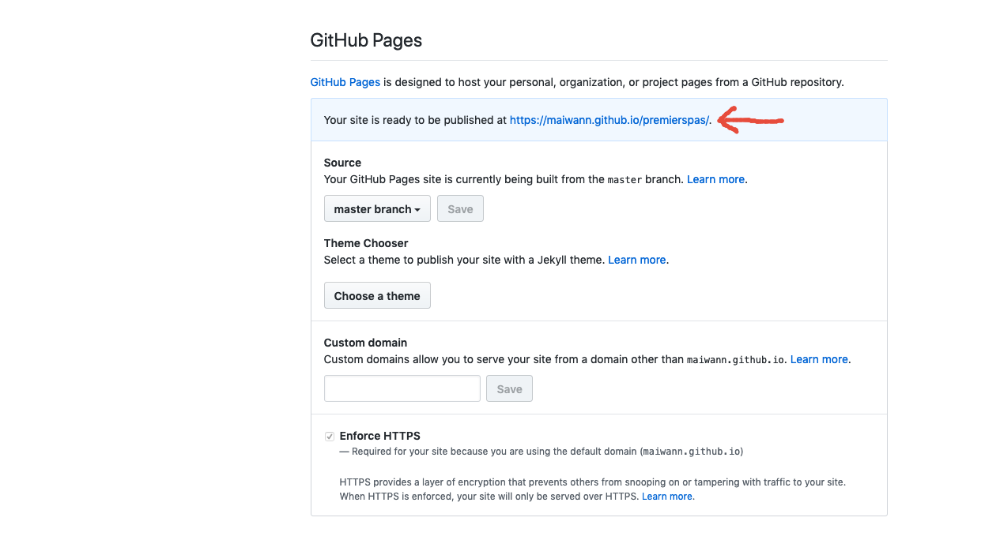
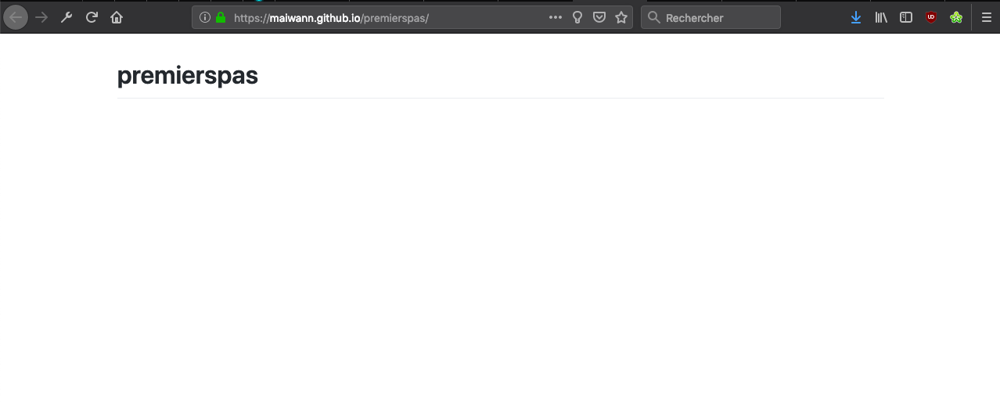

# Étape 2 : Paramétrer GitHubPages

On file dans les Settings (en haut à droite)

Et on descend jusqu'à la zone "GitHub Pages"

## Source

Dans la sous-partie "Source", on va cliquer sur "None" pour choisir "Master branch" à la place.

Puis on appuie sur **Save** pour sauvegarder le changement !

## Hop ! Un site !

La sauvegarde nous fait remonter en haut de la page, et si on redescend au niveau "GitHub Pages", on voit que la section a un peu changé !

Et surtout, ce qui nous intéresse le plus : On a déjà une adresse pour accéder à notre site, qui est publié en ligne !
(Ca peut mettre quelques minutes pour être mis en place, pas de panique !)

Et si je clique dessus, j'arrive sur mon site, avec le contenu du fichier README en première page !

## Étape suivante

Tout ça c'est bien beau, mais si je veux afficher mes articles ? :D
