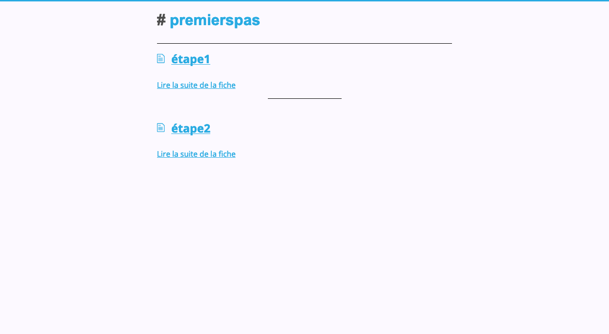

# Étape 3 : Voir la liste de mes articles sur ma page d'accueil

Pour pouvoir avoir mes articles sur la liste de la page d'accueil, il va falloir passer du thème par défaut de GitHubPages qui dit "Affiche-moi le README en page d'accueil" à un autre thème qui dire "Affiche-moi la liste des articles en page d'accueil"

## Créer un fichier de config

Pour ça, on va créer un fichier de configuration qui va dire "Ok on change de thème !"

Retournez sur la page de votre repository, et appuyez sur "Create new file"

Vous appelez ce nouveau fichier : _config.yml

Et à l'intérieur, vous ne mettez qu'une ligne de texte : remote_theme: daktary-team/maquillage

> Ce qui signifie : va prendre un thème qui est à distance, chez l'utilisateur qui s'appelle "daktary-team", le thème s'appelle maquillage

Et vous enregistrez !

Et surprise, après que ça ai un peu mouliné, le résultat est là !
> Notez que j'ai créé les articles que vous lisez au format Markdown (.md) au fur et à mesure, donc il y a déjà du contenu. Tu ne sais pas ce qu'est le markdown ? C'est un format de texte en un peu plus riche, ce lien est pour toi : https://www.markdownguide.org/basic-syntax. En gros, ça me permet de dire "Ca c'est un titre, alors je mets un dièse devant, ça c'est en gras alors je mets deux étoiles avant et après pour qu'il soit en gras"

## TADAM ! 

## Étape suivante

Super tout ça, mais moi je veux pas l'adresse super longue de GitHub, je veux mon adresse à moi… comment je fais ?
