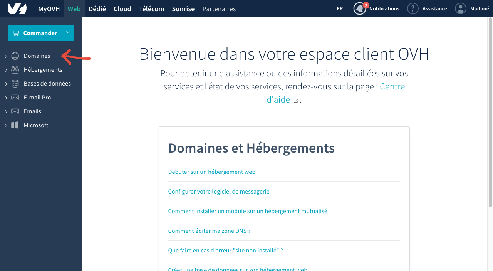
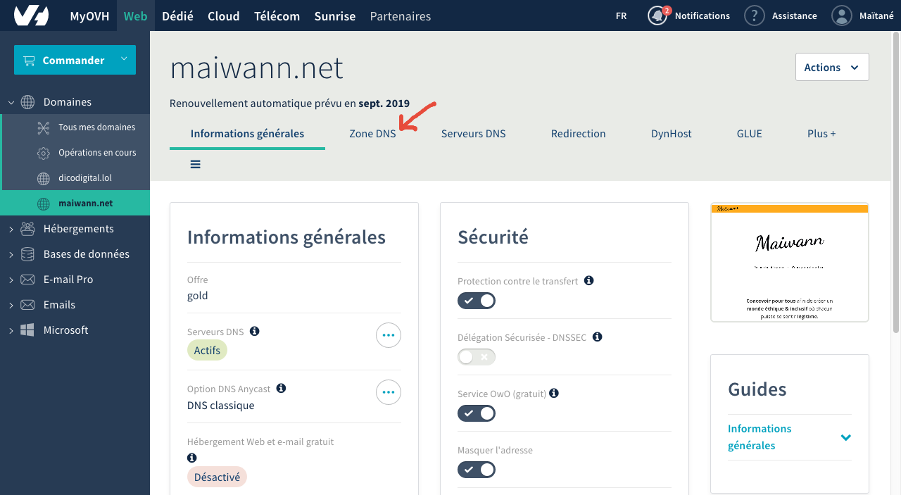
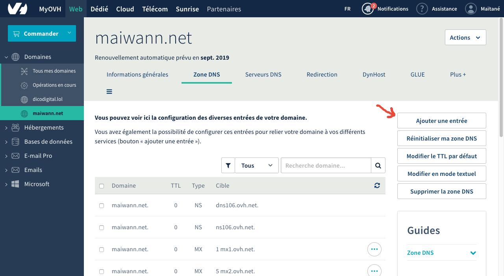
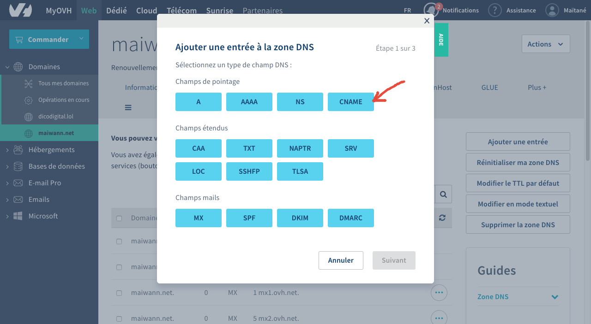
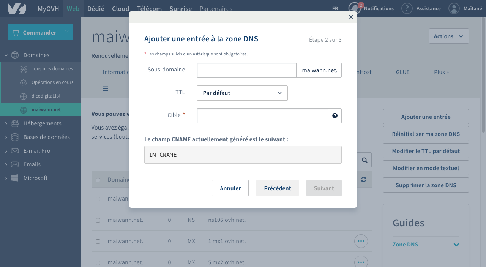
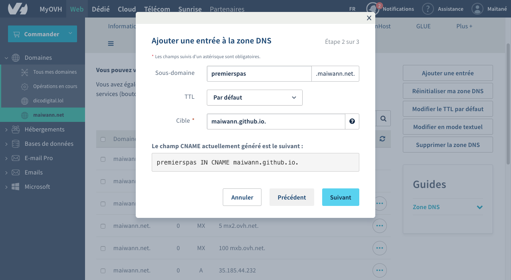

# Étape 4 : Mon url à moi

> L'exemple se fera avec OVH, parce que c'est mon hébergeur, mais je suppose que c'est plus ou moins transposable à n'importe quel site !

## Mon espace client OVH

Rendez-vous sur votre espace client, en vous connectant :)

Une fois connecté·e, je cherche à aller sur le nom de domaine qui m'intéresse (l'adresse qui doit correspondre à mon site)
Ici par exemple, pour moi, ce sera maiwann.net

Je commence par sélectionner "Domaines" dans la barre de navigation à gauche

Puis, maiwann.net parmi les noms de domaines que l'on me propose, et voilà ce qui apparait :

Dans tout ça, je cherche les Zones DNS, car c'est leur paramétrage qui va me permettre de faire ce que je veux :

### Les zones DNS

Une fois que je suis dans l'onglet "Zone DNS", je vais créer une nouvelle entrée !
Je clique donc sur … "Ajouter une entrée", à droite dans l'écran de OVH

On me demande de "Sélectionnez un type de champ DNS :" et je clique sur **CNAME** dans "Champs de pointage" :)

Et j'arrive sur l'écran suivant

Que je remplis comme cela :

Sous-domaine : premierspas.maiwann.net
> Ca peut-être n'importe quel autre sous-domaine soit dit en passant !

TTL : Par défaut
> J'y touche pas :p

Cible : maiwann.github.io.
> Attention ici !! Il faut le remplir en mettant votrepseudo.github.io. (N'oubliez pas ce dernier point :D)

Et je valide !!

Ensuite, la 3e étape n'est remplie que d'informations, donc je la valide aussi :)
Petit point d'attention : vérifiez que vous n'avez pas, dans la liste de vos zones DNS (qui peut être sur plusieurs pages), un autre domaine cible qui sera nommé comme le sous-domaine que vous avez indiqué plus haut (c'était mon cas, ce qui a failli me provoquer des bricoles ^^') Si c'est le cas, supprimez le !

### Bravo !

Ca y est, vous êtes arrivé⋅e⋅s au bout du paramétrage coté OVH !!! BRAVO !!!

Si vous avez encore un peu d'énergie il reste une toute petite étape côté GitHub :)

## Coté GitHub

Retournez sur votre repository :)

Créez un nouveau document, que vous appelerez CNAME

Et à l'intérieur, vous n'écrivez qu'une seule ligne : le nom du sous-domaine que vous avez rentré dans OVH.

Pour moi, c'était premierspas.maiwann.net

Vous enregistrez, et c'est parti !

## HOP !

Et normalement, on est tout bon !!!! Bravoooo :3

Notez que pour moi ça a été quasiment immédiat, mais il est possible que le paramétrage des DNS mette 24h… Il faut être un peu patient⋅e…

Et ensuite, vous pourrez aller sur votre adresse web et tomber sur le même contenu que celui disponible sur l'adresse de github (que vous pouvez toujours retrouver dans Settings)

Youhouhou \o/

